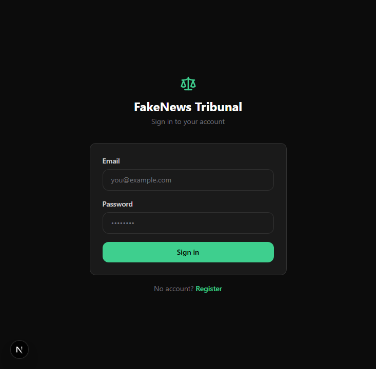
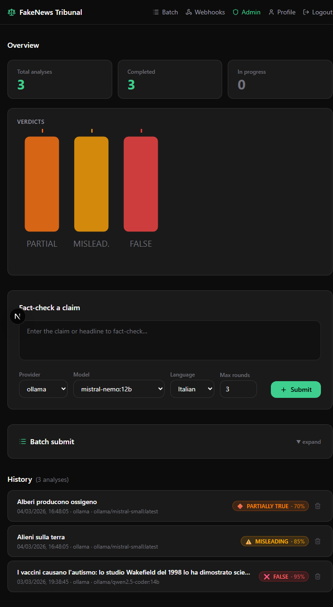

# FakeNews Tribunal

> An autonomous fact-checking system powered by a multi-agent AI debate pipeline.


---

A user submits a claim or news headline. A jury of three specialized AI agents debates it across iterative rounds and returns a structured verdict — with a confidence score, source citations, and full reasoning transparency.

**Current release:** v0.5 — Docker full stack, dynamic dashboard, batch/profile UI, test suite (105 tests), PATCH /auth/me, secrets validation at boot.

---

## Screenshots

| Login | Dashboard |
|---|---|
|  |  |

---

## How It Works

```
Claim submitted
      │
      ▼
  Researcher ──► searches the web, collects evidence (pro & contra)
      │
      ▼
Devil's Advocate ──► challenges sources, hunts for logical flaws
      │
      ▼
    Judge ──► enough evidence? YES → emit verdict / NO → another round
      │
      ▼
  Verdict: label · confidence · reasoning · sources
```

Each round the Judge evaluates whether the evidence is sufficient. If not, the Researcher receives targeted guidance and the cycle repeats (max rounds configurable). The verdict carries one of five labels:

`TRUE` · `FALSE` · `MISLEADING` · `PARTIALLY_TRUE` · `UNVERIFIABLE`

---

## Tech Stack

| Layer | Technology |
|---|---|
| Language | Python 3.12+ |
| REST API | FastAPI + Uvicorn |
| Agent orchestration | Custom (no framework) |
| LLM abstraction | LiteLLM — Anthropic, OpenAI, Gemini, Ollama |
| Web search | Tavily |
| Source credibility | Domain-tier scoring (80+ domains, high/medium/low) |
| Database | PostgreSQL 16 + SQLAlchemy async + Alembic |
| Auth | JWT access tokens (8 h dev / 30 min prod) + bcrypt + refresh token rotation + proactive silent refresh |
| PDF export | fpdf2 + Arial TTF (full Unicode support) |
| Rate limiting | slowapi (10 analyses/hour per user) |
| CLI | Typer |
| Web UI | Next.js 16 + React 19 + Tailwind CSS 4 |
| Logging | structlog (JSON in prod, colored in dev) |
| Testing | pytest + pytest-asyncio + aiosqlite (105 tests, SQLite in-memory) |
| Containerization | Docker Compose (multi-stage builds, named volume for DB persistence) |

---

## Getting Started

### Option A — Docker (recommended for production)

```bash
git clone https://github.com/your-username/fakenews-tribunal.git
cd fakenews-tribunal

cp .env.example .env
# Edit .env and fill in your API keys

docker compose up -d
docker compose exec api alembic upgrade head
```

- Web UI → http://localhost:3000
- API docs → http://localhost:8000/docs

### Option B — Local development

#### Prerequisites

- Python 3.12+
- Node.js 20+
- Docker (for PostgreSQL)
- At least one LLM provider key, or a local [Ollama](https://ollama.com) instance

#### 1. Clone and set up the Python environment

```bash
git clone https://github.com/your-username/fakenews-tribunal.git
cd fakenews-tribunal

python -m venv .venv
# Windows (PowerShell)
.venv\Scripts\Activate.ps1
# macOS / Linux
source .venv/bin/activate

pip install -e ".[dev]"
```

#### 2. Configure environment variables

```bash
cp .env.example .env
# Edit .env and fill in your API keys
```

Key variables:

| Variable | Description |
|---|---|
| `ANTHROPIC_API_KEY` | Anthropic Claude models |
| `OPENAI_API_KEY` | OpenAI GPT models |
| `GEMINI_API_KEY` | Google Gemini models |
| `OLLAMA_BASE_URL` | Local Ollama (default: `http://localhost:11434`) |
| `TAVILY_API_KEY` | Web search — required for all providers |
| `JWT_SECRET_KEY` | Auth secret — **change in production** |
| `ACCESS_TOKEN_EXPIRE_MINUTES` | Access token TTL (default: `480` — 8 h; set to `30` in production) |
| `CORS_ORIGINS` | Allowed origins for the web UI (default: `["http://localhost:3000"]`) |
| `ENV` | `development` enables dev seed and colored logs (default: `development`) |

> You only need the key for the provider you intend to use. `TAVILY_API_KEY` is always required.

#### 3. Start the database and run migrations

```bash
docker compose up db -d

# Linux / macOS / bash
PYTHONPATH=. alembic upgrade head

# Windows PowerShell
$env:PYTHONPATH="."; alembic upgrade head
```

#### 4. Start the API server

```bash
# Linux / macOS / bash
PYTHONPATH=. uvicorn api.main:app

# Windows PowerShell
$env:PYTHONPATH="."; uvicorn api.main:app
```

API docs available at `http://localhost:8000/docs`.

> **Dev seed:** when `ENV=development` (default), the server automatically creates four test accounts on startup if they don't already exist:
> - `admin@tribunal.test` / `Admin1234!` — admin
> - `user1@tribunal.test` / `User1234!`
> - `user2@tribunal.test` / `User1234!`
> - `user3@tribunal.test` / `User1234!`

#### 5. Start the Web UI

```bash
cd web
npm install
npm run dev
```

Web UI available at `http://localhost:3000`.

---

## Web UI

The web interface is a Next.js 16 app located in the `web/` subfolder. It provides:

- **Authentication** — register, login, logout with JWT token management and silent proactive refresh (no mid-session expiry)
- **Dashboard** — dynamic overview with stat cards (total/completed/failed analyses), SVG verdict distribution chart, live agent activity feed via SSE; claim submission form with provider/model/language/rounds selection; paginated history (10/page) with polling when analyses are running
- **Live analysis view** — real-time SSE stream showing each agent's progress; reconnects transparently on tab refocus (Page Visibility API); pre-populates past rounds from DB on re-entry
- **Verdict display** — label, confidence, summary, full reasoning, supporting and contradicting sources with credibility tiers
- **Debate transcript** — collapsible round-by-round view of Researcher, Devil's Advocate, and Judge output
- **PDF export** — one-click download of the full verdict report (Unicode, Arial TTF)
- **Batch analysis** — submit up to 10 claims at once, monitor batch progress with live polling
- **Profile** — change email and password (requires current password confirmation)
- **Admin panel** — list users, enable/disable accounts, change roles, delete users, view global usage stats
- **Ollama model browser** — when Ollama is selected as provider, available models are fetched live from the local instance
- **Resilient streaming** — client disconnect does not kill the background analysis; the SSE queue persists until the task completes

---

## CLI

### Local mode (no server required)

```bash
# Fact-check a claim directly
tribunal check "La Grande Muraglia cinese è visibile dalla Luna"

# Choose provider and model
tribunal check "Vaccines cause autism" --provider openai --model gpt-4o

# Use a local Ollama model
tribunal check "The Earth is flat" --provider ollama --model ollama/mistral --rounds 3

# Output as JSON
tribunal check "..." --output json
```

### Server mode (calls REST API)

```bash
# Register and log in
tribunal login --server http://localhost:8000 --register

# Submit via server (URL stored in ~/.tribunal/config.json after login)
tribunal check "La Terra è piatta" --provider anthropic

# Log out (invalidates refresh token server-side)
tribunal logout
```

---

## LLM Providers

| Provider | Default model | Env var |
|---|---|---|
| `anthropic` | `claude-sonnet-4-6` | `ANTHROPIC_API_KEY` |
| `openai` | `gpt-4o` | `OPENAI_API_KEY` |
| `gemini` | `gemini/gemini-2.0-flash` | `GEMINI_API_KEY` |
| `ollama` | `ollama/llama3.2` | `OLLAMA_BASE_URL` |

Override the model per-request with `--model <model-name>` (CLI), `"llm_model"` field (API), or via the model selector in the web UI. For Ollama, the web UI fetches the list of locally available models automatically.

---

## API Reference

### Auth

| Method | Endpoint | Description |
|---|---|---|
| `POST` | `/api/v1/auth/register` | Create account, returns token pair |
| `POST` | `/api/v1/auth/login` | Login, returns token pair |
| `POST` | `/api/v1/auth/refresh` | Rotate refresh token |
| `POST` | `/api/v1/auth/logout` | Invalidate refresh token |
| `GET` | `/api/v1/auth/me` | Current user info |
| `PATCH` | `/api/v1/auth/me` | Update email and/or password |

### Analysis

| Method | Endpoint | Description |
|---|---|---|
| `POST` | `/api/v1/analysis` | Submit claim → 202 Accepted (10/hour per user) |
| `GET` | `/api/v1/analysis/{id}` | Poll result |
| `GET` | `/api/v1/analysis/{id}/stream` | Stream debate progress via SSE |
| `GET` | `/api/v1/analysis/{id}/export` | Download verdict as PDF |
| `GET` | `/api/v1/analysis` | History (paginated) |
| `DELETE` | `/api/v1/analysis/{id}` | Delete analysis |
| `POST` | `/api/v1/analysis/{id}/resume` | Resume an interrupted analysis |

### Batch

| Method | Endpoint | Description |
|---|---|---|
| `POST` | `/api/v1/batch` | Submit up to 10 claims as a batch |
| `GET` | `/api/v1/batch` | List batches (paginated) |
| `GET` | `/api/v1/batch/{id}` | Batch status and progress |
| `DELETE` | `/api/v1/batch/{id}` | Delete a batch (analyses are kept, unlinked) |

### Webhooks

| Method | Endpoint | Description |
|---|---|---|
| `POST` | `/api/v1/webhooks` | Register a webhook URL |
| `GET` | `/api/v1/webhooks` | List webhooks |
| `DELETE` | `/api/v1/webhooks/{id}` | Delete webhook |
| `POST` | `/api/v1/webhooks/{id}/test` | Send a test event |
| `GET` | `/api/v1/webhooks/{id}/deliveries` | Delivery history |

### Admin

| Method | Endpoint | Description |
|---|---|---|
| `GET` | `/api/v1/admin/users` | List all users (admin only) |
| `GET` | `/api/v1/admin/users/{id}` | User detail (admin only) |
| `PATCH` | `/api/v1/admin/users/{id}` | Update email/password/is_admin/is_disabled (admin only) |
| `DELETE` | `/api/v1/admin/users/{id}` | Delete user (admin only) |
| `GET` | `/api/v1/admin/stats` | Global usage stats (admin only) |

### Other

| Method | Endpoint | Description |
|---|---|---|
| `GET` | `/api/v1/providers/ollama/models` | List available Ollama models |
| `GET` | `/api/v1/health` | Health check |
| `GET` | `/api/v1/config` | Public server configuration |

### Quick curl walkthrough

```bash
# Register
curl -X POST http://localhost:8000/api/v1/auth/register \
  -H "Content-Type: application/json" \
  -d '{"email": "you@example.com", "password": "yourpassword"}'

# Submit a claim (returns analysis_id immediately)
curl -X POST http://localhost:8000/api/v1/analysis \
  -H "Authorization: Bearer <access_token>" \
  -H "Content-Type: application/json" \
  -d '{"claim": "La Terra è piatta", "llm_provider": "anthropic", "max_rounds": 3}'

# Poll for the result
curl http://localhost:8000/api/v1/analysis/<analysis_id> \
  -H "Authorization: Bearer <access_token>"

# Export PDF
curl http://localhost:8000/api/v1/analysis/<analysis_id>/export \
  -H "Authorization: Bearer <access_token>" \
  --output verdict.pdf

# Submit a batch
curl -X POST http://localhost:8000/api/v1/batch \
  -H "Authorization: Bearer <access_token>" \
  -H "Content-Type: application/json" \
  -d '{"claims": ["Claim A", "Claim B"], "llm_provider": "anthropic"}'
```

---

## Webhooks

Webhooks allow external systems to be notified when an analysis completes. Register a URL via `POST /api/v1/webhooks` — optionally provide a `secret` for HMAC-SHA256 signature verification. Each delivery is signed with `X-Tribunal-Signature` and retried automatically (5 s, 30 s, 300 s backoff).

```bash
# Register a webhook
curl -X POST http://localhost:8000/api/v1/webhooks \
  -H "Authorization: Bearer <access_token>" \
  -H "Content-Type: application/json" \
  -d '{"url": "https://your-server.com/hooks/tribunal", "secret": "mysecret"}'
```

---

## Running Tests

```bash
# Install test dependencies (once)
pip install aiosqlite pytest-cov

# Full test suite (no API keys needed — uses SQLite in-memory)
pytest tests/ -v

# Unit tests only
pytest tests/unit/ -v

# Integration tests (real LLM + DB — requires running server)
RUN_INTEGRATION=1 pytest tests/integration/test_debate_flow.py -v
```

The test suite currently has **105 tests** covering auth, analysis, batch, webhooks, admin endpoints, credibility scoring, PDF generation, and schema validation.

---

## Roadmap

### v0.1 — Core ✓
- [x] Multi-agent debate loop (Researcher, Devil's Advocate, Judge)
- [x] LiteLLM multi-provider support (Anthropic, OpenAI, Gemini, Ollama)
- [x] Tavily web search integration
- [x] FastAPI REST API with JWT auth
- [x] PostgreSQL persistence + Alembic migrations
- [x] CLI local mode

### v0.2 — Streaming & Operations ✓
- [x] SSE streaming endpoint (`GET /api/v1/analysis/{id}/stream`)
- [x] CLI server mode (`tribunal login` + `tribunal check --server URL`)
- [x] Per-user rate limiting (10 analyses/hour, slowapi)
- [x] Admin endpoints (user management, usage stats)

### v0.3 — Credibility, Export & Web UI ✓
- [x] Source credibility scoring (domain-tier system, propagated to Judge prompt)
- [x] PDF verdict export (fpdf2 + Arial TTF, full Unicode)
- [x] Web UI (Next.js 16 + React 19 + Tailwind 4, Supabase dark theme)
- [x] Ollama model browser in web UI
- [x] CORS configuration via `CORS_ORIGINS` env var
- [x] Resilient SSE — client disconnect no longer kills the background analysis

### v0.3.x — Admin, Auth Hardening & Dev Experience ✓
- [x] User management: `is_disabled` field, PATCH admin endpoint, disable/enable from web UI
- [x] Resume endpoint (`POST /analysis/{id}/resume`)
- [x] Dev seed — test accounts created automatically on startup
- [x] Access token TTL increased to 8 h for local LLM sessions
- [x] Proactive silent token refresh in the web UI (no mid-session logout)
- [x] SSE queue lifecycle fix — `push_done()` is the sole owner
- [x] Credibility scoring fixes — `removeprefix("www.")`, registrable domain resolution

### v0.4 — Webhooks & Batch ✓
- [x] Webhook support — HMAC-signed POST on verdict completion, automatic retry with backoff
- [x] Batch analysis endpoint (up to 10 claims, `/api/v1/batch`)
- [x] Session expiry feedback in the web UI

### v0.5 — Docker, Dashboard & Tests ✓
- [x] Docker full stack (multi-stage API image, Next.js standalone, named pgdata volume)
- [x] Dynamic dashboard — stat cards, SVG verdict distribution chart, live SSE agent feed
- [x] Dashboard history pagination (10/page, polling + Page Visibility API sync)
- [x] `/batch` page — batch list with live polling
- [x] `/profile` page — email and password change
- [x] `PATCH /api/v1/auth/me` — self-service email/password update
- [x] Secrets validation at boot (`core/startup_checks.py`)
- [x] Test suite — 105 tests with SQLite in-memory fixtures

### Future
- [ ] Plugin system for custom agents
- [ ] E2E browser tests (Playwright)
- [ ] Multi-language UI
- [ ] Celery + Redis for horizontal scaling

---

## License

MIT — see [LICENSE](LICENSE).
